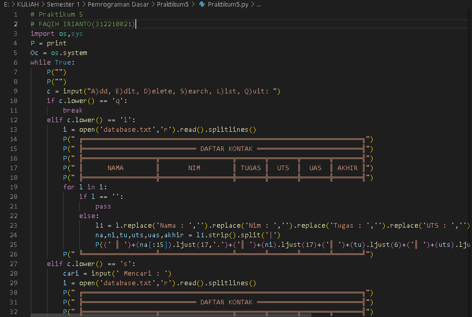

# Praktikum5
# FAQIH IRIANTO(312210021)
# TI 22 C1
- Disini saya menggunakan aplikasi Microsoft Visual Studio Code

- Disini saya akan membuat Perulangan dahulu dengan menggunakan fungsi while true
script ini kita gunakan untuk Bagian menu Pilihanya. Variabel c adalah fungsi input untuk pilihan menu,
lalu c.lower() fungsinya ialah apabila user menginputkan dengan huruf besar ,maka otomatis akan menjadi huruf kecil sehingga kodisi yang di inginkan terpenuhi. if c.lower() == ‘q’ , maka program akan berhenti / keluar.
- sebelumnya saya menggunakan perulangan while True , maka saya hanya perlu menambahkan fungsi break untuk menghentikan perulangan tersebut .

- pertama saya buka file database.txt dan tambahkan “a” di belakang fungsi open , fungsinya menambahkan tanpa menghapus baris sebelumnya (jika sudah ada) sebelumnya. logika yang di buat dari line 142 – 147 adalah untuk memasukan nama ,namun user bebas bisa memasukan string atau int .Pada line 175 -183 ini saya menambahkan int pada fungsi inputnya, dan menggunakan try di dalam while true tujuanya ialah kondisi dari pasanganya try yaitu except , mimin menambahkan fungsi ini karena untuk mendeteksi jika format yang di inputkan bukan merupakan type angka maka akan muncul eror ValueError dan akan mencetak “masukan UAS dengan angka” dan fungsi else-nya ialah jika tidak eror dan type yang dimasukan sesuai maka proses while True(perulanngan) akan berhenti dengan menambahkan break di dalam else.

- Karena pada menu ada kolom 'Akhir' yang di dapatkan dengan menggunakan rumus maka disini saya akan menggunakan fungsi round dan float. Round untuk menentukan banyaknya angka di belakang koma. Float disini saya gunakan untuk untuk mengubah bilangan menjadi float(desimal) , yang nantinya akan di kembalikan dengan round sehingga nanti hasil dari rumus 'Akhir' menjadi seperti yang di inginkan.

-  jika di dalam database terdapat data nya , maka program akan memproses dan akan me-replace string [nama: , Nim ,Tugas ,uts ,uas dan akhir] menjadi [ ]/(tidak ada) jadi yang tersisa adalah nilai dari data input yg terpisah oleh [ “|” ] (na[:15]).ljust(17,’.’) => maka yang akan di ambil adalah 15 space dari nilai nama dan jika melebihi dari 15 maka baris ke 16 – 17 akan di ubah menjadi ‘ . ‘ (titik) dan akan berhenti pada space ke 17. (ni).ljust(17) ini seperti diatas , namun lebi baik di buat seperti di atas supaya lebih rapi apabila kemungkinan nilai ni/nim melebihi 17 space, maka tabel akan kacau , alangkah lebih baik di buat sperti ini (ni[:15]).ljust(17).

- Terima kasih!
# Bahasa pemrograman pertemuan 10